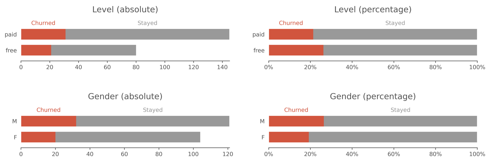

# Sparkify Churn Prediction

A model to predict user churn for a music streaming company, with Spark running on an Amazon Web Services (AWS) Elastic Map Reduce (EMR) cluster.

## Description

The project analyzes the characteristics and behaviors of the users from a music streaming service and, based on that, predicts which ones will churn.

The dataset used is a log file containing all the user interactions with the platform over time, for example: songs listened, pages visited and profile information. Since the file has around 26 million rows (12 Gb), it is practically infeasible to use a single machine to run the model, thus, an AWS EMR cluster was used.

Pandas and Scikit-learn libraries are not able to run on distributed clusters. However, Spark is capable of such, so, it was used to do the extract, transform, load (ETL) process, with the [PySpark SQL module](https://spark.apache.org/docs/2.4.4/api/python/pyspark.sql.html), and apply the machine learning algorithims, with the [PySpark ML Package](https://spark.apache.org/docs/2.4.4/api/python/pyspark.ml.html).

The project is divided into the following tasks:

### 1. Load and Clean Dataset

Load the dataset and prepare it to be analyzed, through: ajusting the data types, dealing with invalid or missing data, correcting the encoding and parsing the [user agent](https://en.wikipedia.org/wiki/User_agent) column.

### 2. Exploratory Data Analysis

Perform an exploratory data analysis for the whole user log file, viewing the number of unique users, the period of the available data and plotting the numerical and categorical features. Also define that the `Churn` will be the `Cancellation Confirmation` events, which happen for both paid and free users, and create a new column for it, to be used as the label for the model.

### 3. Feature Engineering

Build out the features that seem promising to train the model on and put them in a users features matrix. Then, plot the features against the target label (Churn), to indentify and understand possible correlations and causalities.



### 4. Modeling

Create a machine learning model to predict which users will churn based on their characteristics and behaviors. Making a pipeline and processing the users features matrix to be in the correct input format for the model, with indexer, one hot encoder and vector assembler. Tune the parameters through cross validation with grid search, show the results and save the best model.

### 5. Conclusion

Discuss which methods to use moving forward, and how to test how well the recommendations are working for engaging users.

## Dependencies

To run locally:
- Python 3.7.9
- Java 1.8.0_271
- PySpark 2.4.4
- Jupyter notebook 6.2.0
- NumPy 1.19.2
- Pandas 1.2.0
- Matplotlib 3.3.2
- ua-parser 0.10.0
- user-agents 2.2.0

To run on an AWS EMR cluster:
- PySpark 2.4.4
- NumPy 1.14.5
- Pandas 1.0.0
- ua-parser 0.10.0
- user-agents 2.2.0

## Execute

### To run locally:

1. Clone the git repository:

`git clone https://github.com/gabrieltempass/article-recommendation-engine.git`

2. Go to the project's directory.
3. Open the Jupyter notebook, with the command:

`jupyter notebook "notebook/sparkify_churn_prediction.ipynb"`

### To run on an AWS EMR cluster:

This step by step instructions will use the AWS web user interface to create the EMR cluster. But another way would be to use the [AWS CloudFormation](https://docs.aws.amazon.com/AWSCloudFormation/latest/UserGuide/Welcome.html) in the command line.

1. [Login into the AWS console](https://console.aws.amazon.com/console/home). If you do not have an AWS account yet, [create one for free](https://aws.amazon.com/free/).
2. Search for EC2 and go to its page.
3. In the left menu, click in `Key Pairs`, under Network & Security.
4. Click in `Create key pair`.
5. Choose a name for it and click in `Create key pair`.
6. Search for EMR and go to its page.
7. Click in `Create cluster`.
8. Click in `Go to advanced options`.
9. In the Software Configuration section, select `emr-5.29.0`.
10. Still in the Software Configuration section, make sure the boxes `Hadoop 2.8.5`, `JupyterHub 1.0.0`, `Hive 2.3.6`, `Spark 2.4.4` and `Livy 0.6.0` are checked and the rest is unchecked.
11. In the Edit software settings section, make sure the option `Enter configuration` is selected and paste the following code beneath it:

```
[
    {
        "Classification": "livy-conf",
        "Properties": {
            "livy.server.session.timeout-check": "false",
            "livy.server.session.timeout": "24h"
        }
    }
]
```

12. Click in `Next`, to go to Step 2: Hardware.
13. In the Cluster Nodes and Instances section, make sure there is one instance as the driver (master) and two instances as the executors (core), with the following configurations: `m5.xlarge`, `4 vCore`, `16 GiB memory`, `EBS only storage` and `EBS Storage: 64 GiB`.
14. Click in `Next`, to go to Step 3: General Cluster Settings.
15. Click in `Next`, to go to Step 4: Security.
16. In the Security Options, select the EC2 key pair created in the step 5.
17. Click in `Create cluster`.

## Notebook

The Jupyter notebook contains the five parts detailed in the README description.

## Dataset

There are two datasets: the mini, to be used in the local mode to explore the data and test the model, and the full, to be used in a distributed cluster (simulating a production environment). Both of them were provided by Udacity and are available at AWS S3 with these filepaths:

- Full dataset (12 Gb, around 26 million rows):
  
  `s3n://udacity-dsnd/sparkify/sparkify_event_data.json`

- Mini dataset (128 Mb, around 260 thousand rows, 1% of the full dataset):
  
  `s3n://udacity-dsnd/sparkify/mini_sparkify_event_data.json`